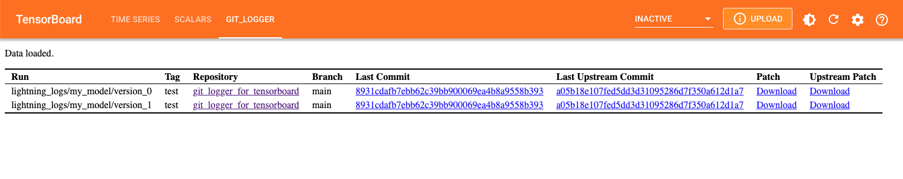

# Git Logger for Tensorboard with Pytorch

## Features

- [x] log current git commit hash
- [x] diffs of current repo state
- [x] pytorch-lightning integration

## Dependencies

Requires:

- python + pip
- tensorboard
- pytorch
- OPTIONAL for display in tensorboard: tensorflow (all custom plugins require full tensorflow installation to work with tensorboard)

## Installation

Ensure you have the above dependencies, then run:

`$ pip install git+ssh://git@github.com/meltzerpete/git_logger_for_tensorboard.git#egg=git_logger_for_tensorboard&subdirectory=git_logger_for_tensorboard`
git+ssh://git@git.autodesk.com/meltzep/groverdenoise.git#egg=groverdenoise&subdirectory=src

## Usage

### Logging

With pytorch-lightning:

```python
import pytorch_lightning as pl
from pytorch_lightning.loggers import TensorBoardLogger
from git_logger_for_tensorboard.git_logger import GitLightningLogger

tensorboard_logger = TensorBoardLogger(save_dir='lightning_logs',
                                       name='my_experiment')
tb_logger = TensorBoardLogger(save_dir='lightning_logs',
                              name='my_model')
GitLightningLogger(tb_logger).log('train')  # all git info/patches are logged to the current lightning run dir

trainer = pl.Trainer(*usual_args,
                     logger=tensorboard_logger)
...
```

With pytorch only:

```python
from torch.utils.tensorboard import SummaryWriter

from git_logger_for_tensorboard.git_logger import GitLogger

summary_writer = SummaryWriter(log_dir='demo6')
GitLogger(summary_writer).log('train')  # all git info/patches are logged to the log_dir

...
```

## Viewing the Logs

If tensorflow is installed, simply go to the `GIT_LOGGER` tab in tensorboard.



If tenorflow is not installed, you can view the logs in the terminal by running:

```shell

```